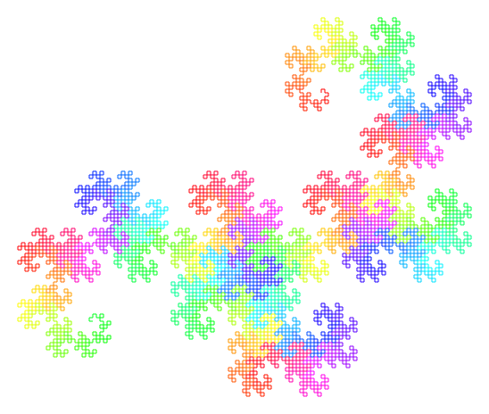

# L-System Fractals

[L-System Fractals on Wikipedia](https://en.wikipedia.org/wiki/L-system)

You can see the javascript code working [here](https://mairazl.neocities.org/fractals/)!

Or you can check the python code [here]('L-System fractals.ipynb').

